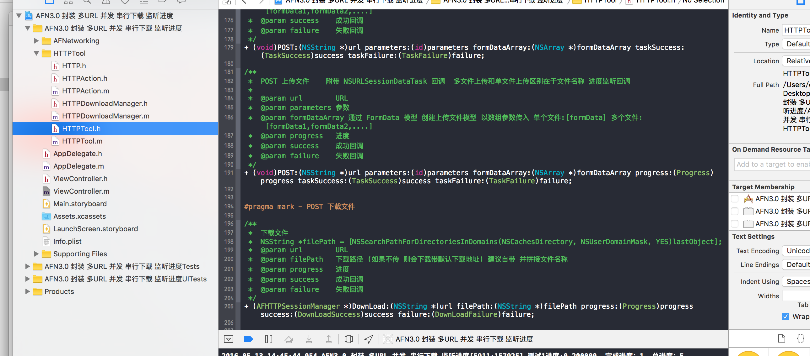

# AFN-3.0-
AFN3.0及以上 封装 多URL 串行下载 监听进度 请求封装  

简单使用AFN 跟 网络请求工具  更换方便

+ (HTTPDownloadManager *)DownloadSerial:(NSArray *)urls
filePath:(NSString *)filePath
identity:(NSString *)identity
failureContinue:(BOOL)failureContinue
progress:(HTTPProgress)progress
success:(HTTPDownLoadSuccess)success
failure:(HTTPDownLoadFailure)failure;

+ (void)POST:(NSString *)url parameters:(id)parameters formDataArray:(NSArray *)formDataArray taskSuccess:(TaskSuccess)success taskFailure:(TaskFailure)failure;

+ (void)GET:(NSString *)url parameters:(id)parameters progress:(Progress)progress taskSuccess:(TaskSuccess)success taskFailure:(TaskFailure)failure;

。。。。。。。 可以下载看详细

